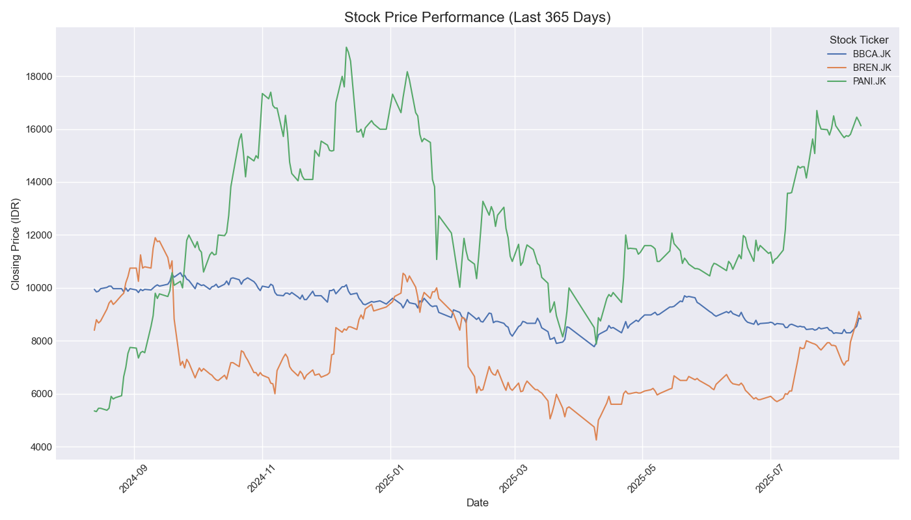

# Simple Stock Price Visualizer

## 📈 Project Overview

This project is a Python script that fetches historical stock price data for selected companies from the Indonesia Stock Exchange (IDX) and visualizes their performance over the last year. It uses the `yfinance` library to access Yahoo Finance's API and `matplotlib`/`seaborn` to plot the data.

The primary goal is to create a clear, comparative line chart of the daily closing prices.

---

## 🚀 Final Visualization

Here is the final output comparing the stock prices of BBCA, BREN, and PANI:



---

## 🛠️ Technologies & Libraries Used

* **Language:** Python 3
* **Libraries:**
    * `yfinance`: For downloading financial market data.
    * `pandas`: For data manipulation and handling.
    * `matplotlib` & `seaborn`: For data visualization.

---

## ⚙️ How to Run This Project Locally

1.  **Clone the repository:**
    ```bash
    git clone [https://github.com/YOUR_USERNAME/stock-price-visualizer.git](https://github.com/YOUR_USERNAME/stock-price-visualizer.git)
    cd stock-price-visualizer
    ```

2.  **Install the necessary packages:**
    ```bash
    pip install -r requirements.txt
    ```
    *(Note: You will need to create a `requirements.txt` file for this step. See instructions below.)*

3.  **Run the script:**
    ```bash
    python stock_visualization.py
    ```

---

### Creating the `requirements.txt` file

To make it easy for others to run your project, create a `requirements.txt` file. In your terminal, run this command inside your project folder. It automatically captures the libraries and their versions.

```bash
pip freeze > requirements.txt
